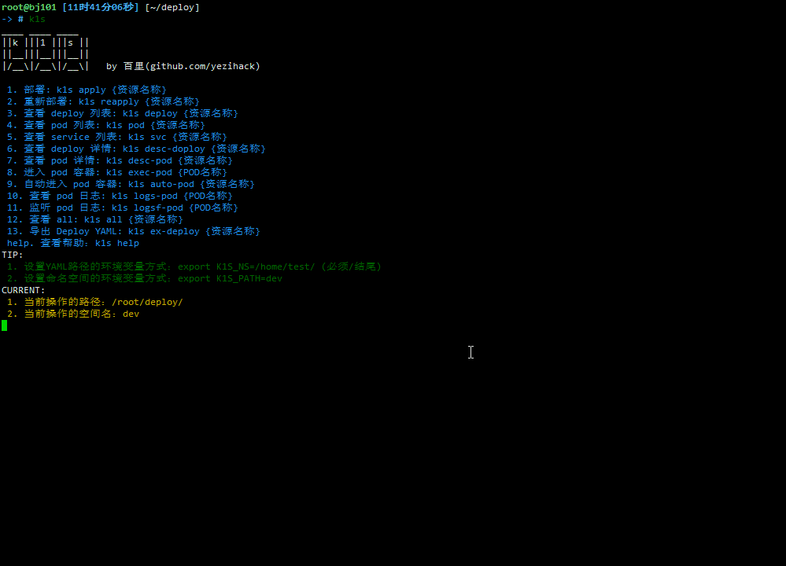

[](https://github.com/yezihack/k1s)
[](https://github.com/yezihack/k1s/blob/master/LICENSE)

# k1s: kubernetes 快捷操作的辅助工具

```text
     __    ____        
|  | _/_   | ______
|  |/ /|   |/  ___/
|    < |   |\___ \ 
|__|_ \|___/____  >
     \/         \/  by 百里(github.com/yezihack)
```



## 什么是k1s

k1s 主要是用于 kubernetes 管理的命令行工具。

## 功能

- 查看Nodes（nodes）
- 部署应用资源（apply）
- 重新部署应用资源（reapply）
- 查看 deploy 资源应用列表（deploy/deploys）
- 查看 pod 资源列表（pod/pods|p|ps）[监听(w)]
- 查看 service 资源列表（svc/svcs）
- 查看 endpoints 资源列表（ep/eps）
- 查看 daemonsets 资源列表（ds/dss）
- 查看 node 资源详情（desc-node）
- 查看 deploy 资源详情（desc-deploy）
- 查看 pod 资源详情（desc-pod）
- 查看 endpoints 资源详情（desc-ep）
- 查看 daemonsets 资源详情（desc-ds）
- 查看 pod YAML（yaml-pod）
- 查看 deploy YAML（yaml-deploy）
- 查看 service YAML（yaml-svc）
- 进入 pod 容器（exec）
- 自动进入 pod 容器（auto）
- 查看 pod 日志（logs）
- 监听 pod 日志（logsf）
- 查看 deploy, servier, pod 三种资源（all）
- 导出 deploy YAML（ex-deploy）
- 删除 pod 资源 (rm-pod|rm-pods
- 删除 deploy 应用 (rm-deploy
- 清理垃圾(clean)

## 安装

直接下载脚本，依赖 kubectl, 其它无须任何。

```sh
wget https://raw.githubusercontent.com/yezihack/k1s/master/k1s
chmod +x k1s
mv k1s /usr/local/bin
```

## 使用方法

K1S脚本直接在计算机上运行。它具有以下命令行界面：

```sh
k1s [操作类型] [资源名称]
```

或设置环境变量，获得更多操作方式：

```sh
export K1S_NS=[空间名称]
# 设置路径时使用下划线结束 (/)
export K1S_PATH=[操作路径] 

k1s [操作类型] [资源名称]
```

- 操作类型 是必选
- 资源名称 是可选

### 使用实例

假设需要部署的应用名称: nginx-test.yaml  

tip: apply, reapply 要求应用名称与文件名同名，方便操作识别。

- 设置环境变量

```sh
# 设置环境变量,路径必须以斜杆(/)结尾
export K1S_PATH=/home/sgfoot/
export K1S_NS=dev
```

- 部署 YAML 应用

```sh
k1s apply nginx-test
```

- 重新部署 YAML 应用

```sh
k1s apply nginx-test
```

- 查看 deploy 应用资源列表

```sh
# 查看所有的
k1s apply

# 查看单个资源
k1s apply nginx-test
```

- 查看 pod 资源列表

```sh
# 查看所有的
k1s pod

# 查看单个资源
k1s pod nginx-test
```

- 自动进入 POD 容器

```sh
# 只需要填写 deploy 资源名称，脚本自动查找 pod 的列表，默认选择第一个。
k1s auto-pod nginx-test
```

- 导出 deploy YAML 资源

如果设置 K1S_PATH 则保证在指定目录，如果没有设置则保存在当前目录。

```sh
# 导出当前操作空间下的所有 deploy 资源，每个资源一个YAML文件
k1s ex-deploy 

# 导出单个资源的 yaml
k1s ex-deploy nginx-test
```

- 清理垃圾

目前支持清理 UnexpectedAdmissionError 错误垃圾。

```sh
# 查看不同空间下统计的错误信息
k1s clean 

# 清理指定空间下的错误信息
k1s clean dev
```